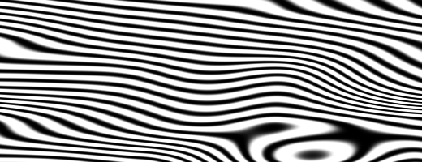

## ノイズ

少し休憩しましょう。テレビのホワイトノイズみたいなランダム関数で遊んできて、頭はまだシェーダーのことでいっぱい。目も疲れてきました。散歩に出る時間です。

空気を肌に、日差しを顔に感じます。世界はこのように鮮やかで豊かな場所なのです。色、肌合い、音。歩いている間中、道や岩、木や雲の表情に気を取られずにはいられません。


これらのテクスチャーの不規則さをランダムと呼ぶこともできるでしょう。しかし、これらの外見は前の章で私たちが扱ってきたランダムとは違います。現実世界は実に豊かで複雑な場所なのです。どうすればコンピューターを用いてこの多様な世界に近づくことができるでしょうか。

この疑問は1980年代初頭、「TRON」という映画のためによりリアルなテクスチャーを生成するという依頼を受けて[Ken Perlin](https://mrl.nyu.edu/~perlin/) が取り組んでいた問題です。 結果として、彼はオスカー賞に輝くエレガントなノイズ・アルゴリズムにたどりつきました。


下記はクラシックなパーリンノイズのアルゴリズムではありませんが、ノイズを生成する方法について理解するためのよい出発点になります。

（訳注：「クラシックなパーリンノイズ」とはKen Perlinが最初に考案したアルゴリズムを、またここでの「ノイズ」はパーリンノイズに代表される、擬似乱数的でありながらスムーズな連続性を持ったアルゴリズムを指しています。）

<div class="simpleFunction" data="
float i = floor(x);  // integer
float f = fract(x);  // fraction
y = rand(i);
//y = mix(rand(i), rand(i + 1.0), f);
//y = mix(rand(i), rand(i + 1.0), smoothstep(0.,1.,f));
"></div>

ここでは前の章と似たことをしています。連続的な浮動小数点数の値（```x```）を整数（```i```）と少数部分（```f```）に分けます。[```floor()```](.../glossary/?search=floor) を ```i``` を得るために、[```fract()```](.../glossary/?search=fract) を ```f``` を得るために使います。そして ```x``` の整数部分ごとに ```rand()``` を使ってランダムな値を生成します。

その後にコメントのついた行が2行あります。1行目ではそれぞれのランダムな値を線形補間しています。

```glsl
y = mix(rand(i), rand(i + 1.0), f);
```

この行のコメントを外して、どのように見えるか観察してみましょう。2つのランダムな値を [```mix()```](.../glossary/?search=mix) するために、```f``` に格納されている [```fract()```](.../glossary/?search=fract) の値を使います。

ところで、この本では線形補間よりもよい方法も学びましたね。次の行のコメントを外してみましょう。直線で補間する代わりに [```smoothstep()```](.../glossary/?search=smoothstep) が使われています。

```glsl
y = mix(rand(i), rand(i + 1.0), smoothstep(0.,1.,f));
```

コメントを外したら、ピークとピークの間の変化がスムーズになっていることに注目してください。実際に世の中で使われているノイズの実装をいくつか見てみると、[```smoothstep()```](.../glossary/?search=smoothstep) よりも、カスタムの3次関数のカーブ（例えば下記のような式）をプログラマーは好んで用いることに気がつくでしょう。

```glsl
float u = f * f * (3.0 - 2.0 * f ); // custom cubic curve
y = mix(rand(i), rand(i + 1.0), u); // using it in the interpolation
```

ノイズの滑らかかつランダムな性質は、グラフィックエンジニアやアーティストにとって革新的なもので、有機的な表情を持つ画像や形状を生成する力を与えてくれます。パーリンノイズのアルゴリズムは様々な言語や場面で繰り返し実装され、あらゆるクリエィティブな領域で目を見張るような作品を作り出してきました。


次はあなたの番です。

* あなた自身の ```float noise(float x)``` 関数を作ってみましょう。

* ノイズ関数を使って、1つの形が動いたり、回転したり、または大きさが変わったりするアニメーションを作りましょう。

* ノイズを用いていくつかの形が一緒にダンスしているようなアニメーションを作りましょう。

* ノイズ関数を使って有機的に見える形を描いてみましょう。

* あなたの自身の創造物を生みだしたら、特有の動きを与えて個性を持ったキャラクターに発展させてみましょう。

## 2Dノイズ


一次元のノイズを扱い方を学んだので、次は二次元に移りましょう。線上の2点（```fract(x)``` と ```fract(x)+1.0```）の間を補間する代わりに、平面上の正方形4つの角 （```fract(st)```, ```fract(st)+vec2(1.0,0.0)```, ```fract(st)+vec2(0.0,1.0)```, ```fract(st)+vec2(1.0,1.0)```）の間を補間します。


同様にして、三次元のノイズを手に入れるには、立方体の8つの角の間を補間する必要があります。このテクニックはランダムな値の補間が全てなので、バリューノイズ とよばれています（訳注：value noiseの適当な日本語訳が見つかりませんでした。ご存知の方は教えてください）。


一次元の例と同じく、この補間は線形ではなく3次関数によるもので、四角いグリッドの中のどの点もスムーズに補間できます。


下記のノイズ関数を見てください。

<div class="codeAndCanvas" data="2d-noise.frag"></div>

まず空間を5倍に拡大します（45行目）。そしてノイズ関数の中で空間を升目に分割します。升目の位置を示す整数と、升目の中での位置を表す端数部分を共に変数に格納します。整数の位置を4つの角の座標の計算に用い、それぞれに対するランダムな値を獲得します（23-26行）。最後に35行目では、格納しておいた端数の位置を使って、角の4つのランダムな値の間を補間しています。

あなたの番です。下記の課題に挑戦しましょう。

* 45行目の掛ける数を変えてみましょう。また、このサンプルをアニメーションにしてみましょう。

* どのぐらいズームすると、ノイズがまたただのランダムに見え始めるでしょう。

* ノイズが小さすぎて見えなくなるまでにはどれくらいズームすればよいでしょう。

* このノイズ関数をマウスの位置に対応して変化させてみましょう。

* ノイズのグラデーションをディスタンスフィールドとして扱うとどうなるでしょう。これを使って何か興味深いものを使ってください。

* ある程度、秩序とカオスをコントロールできるようになったので、この知識を活用してみましょう。 いくつかの四角形と色、ノイズを組み合わせて[ロスコ](http://en.wikipedia.org/wiki/Mark_Rothko)の絵画のような複雑な表情の作品を作ってみましょう。


## ノイズを使ったジェネラティブデザイン

ノイズのアルゴリズムは本来、自然な *je ne sais quoi* （訳注：言葉では表せない質感、美しさ）をデジタルなテクスチャーに与えるために考え出されました。ここまで見てきた一次元と二次元の実装はランダムな値の間の補間を行うもので、そのためバリューノイズと呼ばれていました。しかしノイズを作り出す方法はこれだけではありません。

[  ](../edit.html#11/2d-vnoise.frag)

課題の中で気付いたと思いますが、バリューノイズはブロック状に見えてしまいがちです。これを抑えるため、[Ken Perlin](https://mrl.nyu.edu/~perlin/) は1985年にグラデーションノイズ（gradient noise）と呼ばれるアルゴリズムを開発しました。このグラデーションは一次元の値（```float```）の代わりに、向きを持った（```vec2```）を返す二次元のランダム関数によって作り出されます。下記の画像をクリックしてコードを表示し、仕組みを見てみましょう。

[  ](../edit.html#11/2d-gnoise.frag)

上記2つの[Inigo Quilez](http://www.iquilezles.org/)によるサンプルをじっくり見比べてみましょう。[バリューノイズ](https://www.shadertoy.com/view/lsf3WH)と[グラデーションノイズ](https://www.shadertoy.com/view/XdXGW8)との違いに注目してください。

絵の具の中の顔料の働きを理解している画家のように、ノイズの実装方法について詳しくなるほど、より上手に使いこなせるようになります。例えば複数の直線が描かれた空間を回転させるために二次元のノイズを使うと下記の通り、木目のように見える渦巻き状の効果を作り出すことができます。画像をクリックするとコードも見ることができます。

[  ](../edit.html#11/wood.frag)

```glsl
    pos = rotate2d( noise(pos) ) * pos; // rotate the space
    pattern = lines(pos,.5); // draw lines
```

ノイズから面白いパターンを作り出すもう1つの方法は、ノイズをディスタンスフィールドのように扱い、[形について](../07/)の章で取り上げたテクニックを応用することです。

[  ](../edit.html#11/splatter.frag)

```glsl
    color += smoothstep(.15,.2,noise(st*10.)); // Black splatter
    color -= smoothstep(.35,.4,noise(st*10.)); // Holes on splatter
```

3つ目の方法はノイズ関数を図形を変形させるのに使うことです。これにもまた[形について](../07/)の章で学んだテクニックが必要になります。

<a href="../edit.html#11/circleWave-noise.frag"><canvas id="custom" class="canvas" data-fragment-url="circleWave-noise.frag"  width="300px" height="300"></canvas></a>

練習してみましょう。

* 他にどんなパターンが生成できるでしょう。御影石、大理石、マグマ、水のようなパターンはどうでしょう。好きなパターンの画像を3つ用意して、ノイズを使ったアルゴリズムで実装してください。

* ノイズを使って図形を変形させてください。

* ノイズを動きのために使うのはどうでしょう。[二次元行列](../08/)の章を振り返ってください。小さな十字を平行移動させるサンプルを使ってランダムとノイズを応用した動きをさせてみましょう。

* アルゴリズム版のポロックを作り出しましょう。


## シンプレックスノイズ

Ken Perlinにとって彼のアルゴリズムの成功は十分ではありませんでした。彼はもっとパフォーマンスをあげられると考えたのです。2001年のSiggraphで彼は、以前のアルゴリズムに比べて下記の改良を実現したシンプレックスノイズを発表しました。

* よりシンプルで乗算の回数が少ない。

* 次元の数が増えても計算量の増加が抑えられる。

* 向きによって生じるアーティファクトがない。

* 非常に計算量の少ない、矛盾なく定義（[well-defined](https://ja.wikipedia.org/wiki/Well-defined)）された[連続](https://ja.wikipedia.org/wiki/%E9%80%A3%E7%B6%9A_(%E6%95%B0%E5%AD%A6))なグラデーション
（訳注：どこを取っても拡大すれば滑らかに繋がっているグラデーションが軽い処理で実現できる、程度に思ってください。もう少し厳密な説明はリンク先をどうぞ）。

* ハードウェアで実現しやすいアルゴリズム。

この男は一体何者だ、と思っているかもしれませんね。そう、彼の仕事は本当に素晴らしい。しかし実際、どうやって彼はアルゴリズムを改善したのでしょう。

私たちは二次元のノイズで4つの頂点（正方形の角）の間を補間するのを見ました。ここから三次元では8頂点（[実装例](../edit.html#11/3d-noise.frag)）、四次元では16頂点の補間が必要なことも推測できます。分かりますね。言い換えればN次元に対しては2のN乗の頂点を補間する必要があります。しかしKen Perlinはここで賢くも気付きました。空間を隙間なく埋める形として正方形を選ぶのは当然だけれども、二次元空間で最もシンプルな形は正三角形です。そこで彼は（我々がこの章でやり方を学んだ）正方形のグリッドを単純な正三角形で置き換えることから始めたのです。


N次元に対して最も単純な形は N + 1 の頂点を持ちます。つまり二次元に対しては1頂点、三次元に対しては4頂点、四次元に対しては11頂点少ない計算で済むのです。これは大幅な改善です。

シンプレックスノイズでも、二次元では普通のノイズの場合と同様に領域の頂点の値の補間が行われますが、より簡単な（正三角形の）グリッドを用いるので3つの頂点に対してだけ補間をすれば良いのです。


どうやってこのグリッドは作られるのでしょう。ここがもう1つの素晴くエレガントなアイデアなのですが、正三角形のグリッドは正方形のグリッドを2つの二等辺三角形に分割し、それを正三角形になるまで斜めに変形させていくことで得ることができます。


そしてStefan Gustavsonが[論文で説明しているように](http://staffwww.itn.liu.se/~stegu/simplexnoise/simplexnoise.pdf)、「変形された座標（x, y）の整数部分を見ることで、評価したい点がどの2つの三角形からなるマス目に含まれるのかを簡単に決定することができます。またxとyの値を比べることで上下どちらの三角形に含まれているのかも分かり、正しい3つの頂点に対して処理をすることができます」。

下記のコードでは、44行目のコメントを外すとどのようにグリッドが歪められるか、47行目のコメントを外すとどのように正三角形のグリッドが構成されるかを見ることができます。
22行目では、```x``` と ```y``` を比較するだけで歪められた正方形を2つの正三角形に分割していることに注目してください（```x > y``` であれば下の三角形、```y >= x``` であれば上の三角形です）。

<div class="codeAndCanvas" data="simplex-grid.frag"></div>

Ken Perlinがシンプレックスノイズで導入したもう1つの改善点は、3次エルミート曲線（f(x) = 3x^2-2x^3 これは [```smoothstep()```](.../glossary/?search=smoothstep)関数と同等です）を4次エルミート曲線（f(x) = 6x^5-15x^4+10x^3）で置き換えたことです。これによって曲線の両端がより平坦になり、隣の曲線に綺麗につながることで、マス目間の変化がより滑らかになります。下記のグラフの2つ目の式のコメントを外すと実際に見ることができます（もしくは[ここ](https://www.desmos.com/calculator/2xvlk5xp8b)で並べて比較することもできます）。


<div class="simpleFunction" data="
// Cubic Hermine Curve.  Same as SmoothStep()
y = x*x*(3.0-2.0*x);
// Quintic Hermine Curve
//y = x*x*x*(x*(x*6.-15.)+10.);
"></div>

カーブの端の様子がどのように変わるかに注目しましょう。より詳しく知りたければ[Ken Perlin自身の言葉](http://mrl.nyu.edu/~perlin/paper445.pdf)で読むこともできます。

これら全ての改善の結果、シンプレックスノイズというアルゴリズムの傑作が生まれました。下記はIan McEwanが[この論文](http://webstaff.itn.liu.se/~stegu/jgt2012/article.pdf)で示したGLSLによるアルゴリズムの実装です。教育目的のためかなり複雑になっていますが、実際のコードはそれほど謎めいていないので安心してください。下記の画像をクリックして見てみましょう。

[  ](../edit.html#11/2d-snoise-clear.frag)

技術的な話は十分ですね。今度はこの財産をあなたの表現に使う番です。

* それぞれのノイズの実装をじっくり見てみましょう。これらを彫刻家にとっての大理石の岩のような加工前の材料だと想像してください。それぞれの素材が持つ感覚や風合いについて何が言えますか。想像力を働かせるために目を細めてみましょう、雲の中に形を見つけるときのように。何が見えますか。何を思い出しますか。それぞれのノイズはどんなものに作り変えることができるでしょう。直感に従ってコードで実現してみましょう。

* [ラバランプ](https://www.google.com/search?q=lava+lamp&espv=2&biw=1682&bih=1148&source=lnms&tbm=isch&sa=X&ved=0ahUKEwiHraP9gLDKAhUY7mMKHbqhBVIQ_AUIBygC)、インクの水滴、水などのように、流れているかのような錯覚を起こさせるシェーダーを作ってください。


<a href="../edit.html#11/lava-lamp.frag"><canvas id="custom" class="canvas" data-fragment-url="lava-lamp.frag"  width="520px" height="200px"></canvas></a>

* シンプレックスノイズを使ってこれまで作った作品にテクスチャーを加えてみましょう。

<a href="../edit.html#11/iching-03.frag"><canvas id="custom" class="canvas" data-fragment-url="iching-03.frag"  width="520px" height="520px"></canvas></a>

この章ではカオスを多少なりとも制御してみました。簡単というわけにはいきませんでしたね。ノイズ使いの達人になるには時間も努力も必要です。

続く章ではスキルを完璧なものにし、シェーダーによる質の高い作品作りにノイズをさらに生かすため、幾つかの有名なテクニックを見ていくことになります。それまでの間、少し外で自然とその複雑なパターンをじっくり眺めて楽しんでください。物事を観察するスキルは、何かを作り出すスキルと同じくらいの（もしかするともっと）献身を必要とします。外に出かけて残りの一日を楽しみましょう。

<p style="text-align:center;">「木に話しかけて、友達になりましょう。」
	<a href="https://ja.wikipedia.org/wiki/%E3%83%9C%E3%83%96%E3%83%BB%E3%83%AD%E3%82%B9">ボブの絵画教室</a></p>