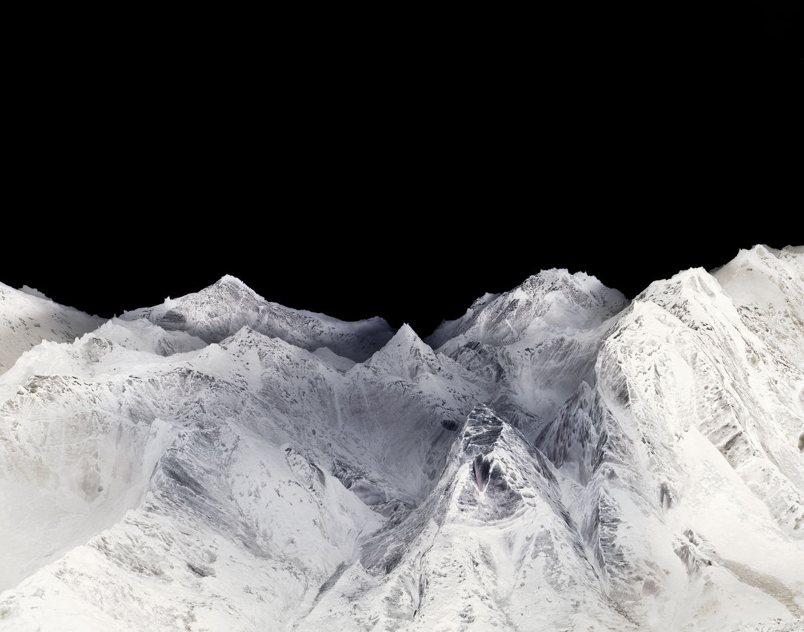
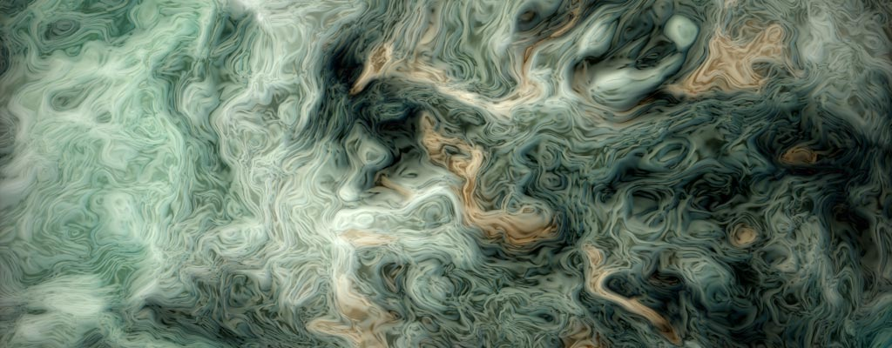

## Fractal Brownian Motion

Noise tends to means different things for different people. Musicians will think it in disturbing sounds, communicators as interference and astrophysics as cosmic microwave background. In fact most of this concept have one things in common that bring as back to the begining of random. Waves and their properties. Audio or electromagnetical waves, fluctuation overtime of a signal. That change happens in amplitud and frequency. The ecuation for it looks like this:

<div class="simpleFunction" data="
float amplitud = 1.;
float frequency = 1.;
y = amplitud * sin(x * frequency);
"></div>

* Try changing the values of the frequency and amplitud to understand how they behave.
* Using shaping functions try changing the amplitud overtime.
* Using shaping function try changing the frequency overtime.

By doing the last to excersize you have manage to "modulate" a sine wave, and you just create AM (amplitud modulated) and FM (frequency modulated) waves. Congratulations!

Another interesting property of waves is their ability to add up. Comment/uncomment and tweak the following lines. Pay atention on how the frequencies and amplitudes change conform we add different waves.

<div class="simpleFunction" data="
float amplitud = 1.;
float frequency = 1.;
y = amplitud * sin(x * frequency);
float t = 0.01*(-u_time*130.0);
y += sin(x*2.1 + t)*4.5;
y += sin(x*1.72 + t*1.121)*4.0;
y += sin(x*2.221 + t*0.437)*5.0;
y += sin(x*3.1122+ t*4.269)*2.5;
y *= 0.06;
"></div>

* Experiment by changing their values.
* Is it possible to cancel two waves? how that will look like?
* Is it possible to add waves in such a way that they will amplify each other? 

In music, each note is asociated with specific a frequency. This frequencies seams to respond to a pattern where it self in what we call scale. 

By adding different iterations of noise (*octaves*), where in each one increment the frequencies (*Lacunarity*) and decreasing amplitude (*gain*) of the **noise** we can obtain a bigger level of granularity on the noise. This technique is call Fractal Brownian Motion (*fBM*) and in it simplest form looks like the following code

<div class="simpleFunction" data="// Properties
const int octaves = 1;
float lacunarity = 2.0;
float gain = 0.5;
//
// Initial values
float amplitud = 0.5;
float frequency = x;
//
// Loop of octaves
for (int i = 0; i < octaves; i++) {
&#9;y += amplitud * noise(frequency);
&#9;frequency *= lacunarity;
&#9;amplitud *= gain;
}"></div>

* Progressively change the number of octaves to iterate from 1 to 2, 4, 8 and 10. See want happens.
* With over 4 octaves try changing the lacunarity value.
* Also with over 4 octaves change the gain value and see what happens.

Note how each in each octave the noise seams to have more detail. Also note the self similarity while more octaves are added.

The following code is an example of how fBm could be implemented on two dimensions.

<div class='codeAndCanvas' data='2d-fbm.frag'></div>

* Reduce the numbers of octaves by changing the value on line 37
* Modify the lacunarity of the fBm on line 47
* Explore by changing the gain on line 48

This techniques is use commonly to construct procedural landscapes. The self similarity of the fBm is perfect for mountains. If you are interested in this use you defenetly should read [this great article of Inigo Quiles about advance noise](http://www.iquilezles.org/www/articles/morenoise/morenoise.htm). 



Using escentially the same technique is also possible to obtain other effect like what is known as **turbulence**. It's esentially a fBm but constructed from the absolute value of a signed noise.

```glsl
for (int i = 0; i < OCTAVES; i++) {
    value += amplitud * abs(snoise(st));
    st *= 2.;
    amplitud *= .5;
}
```

<a href="../edit.html#13/turbulence.frag"></img></a> 

Another member of this family of algorithms is the **ridge**. Constructed similarly to the turbolence but with some extra calculations:

```glsl
    n = abs(n);     // create creases
    n = offset - n; // invert so creases are at top
    n = n * n;      // sharpen creases
```

<a href="../edit.html#13/ridge.frag"></img></a> 

### Domain Warping

[Inigo Quiles wrote this other fascinating article](http://www.iquilezles.org/www/articles/warp/warp.htm) about how is possible to use fBm to warp a space of a fBm. Mind blowing, Right? Is like the dream inside the dream of Inception. 



A mild example of this technique is the following code where the wrap is use to produce something this clouds-like texture. Note how the self similarity propertie still is apreciated.

<div class='codeAndCanvas' data='clouds.frag'></div>
